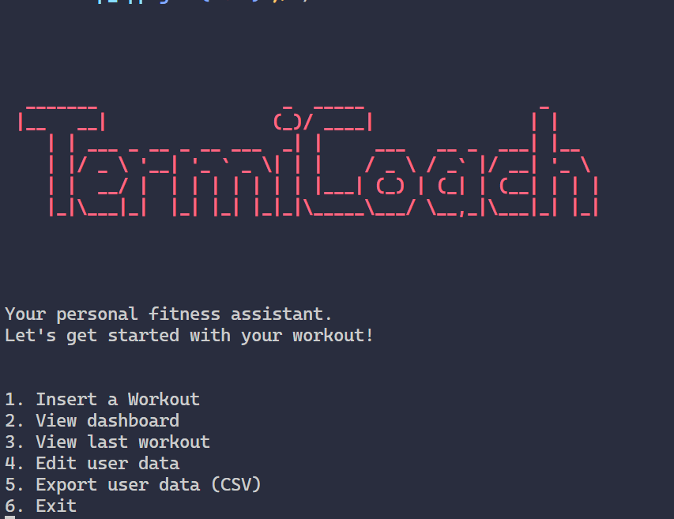

# TermiCoach
> *TermiCoach* (Naming convention): Terminal Coach 

Terminal based application that you can run on (*Windows, Linux, MacOS*), for logging daily workouts and saving them onto a local database.

1. [Features](#features)
2. [Guide](#guide)
3. [Installation](#installation)
## Features
- Utilizes AI in calculating amount of calories burnt 
- Saves your daily workouts onto a local database
- Open an intuiative dashboard for basic analysis 
- Can Export data to CSV

## Guide
Interactions with the program are basically just inputs and choosing numbers. At the start of the application you are asked to enter your information, you must give a value, it doesn't necessarly need to be your real personal information (You can write a nickname), your weight and height are for the AI model to give you insights about your further program.

**View Dashboard**: By choosing this option (2), you would be redirected to an *HTML* webpage, that has your statistics.   

**Export data**: When you export the data you must write the name when you are asked to, doing otherwise would break the program.

## Installation 
Go to te releases section, find the latest version, and install the compatible file with your system.

**Note:** If you are on windows you may encounter a security issue from your firewall, that is mostly becuase the program makes a network request using (curl) to the AI model. You can safely ignore it and run the program and test it yourself.

I would love to hear your feedback, which you can leave as an issue on this repository.

## Contribution
Contributing to this program is welcomed, it is written in `C++`, you work on `Desktop_App` folder specifically on the `main.cpp` file that has all the source code, once you are done you can run the ./build.sh which is a script for compiling the main.cpp file to both binary for Linux and (*.exe*) for Windows.

If you like to work on the dashboard which is the frontend, you work on the `./Dashboard` folder inside it you would find the `dashboard.html`, you must not change the name of the html unless you want to make a major update on it you can create an issue on this repository first and mention me on it.

At the end, you can make a pull request so i can merge and add the the compiled program versions onto the `releases` section.